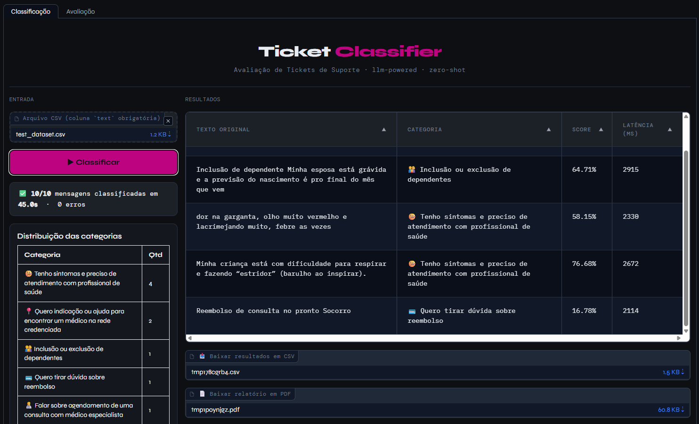
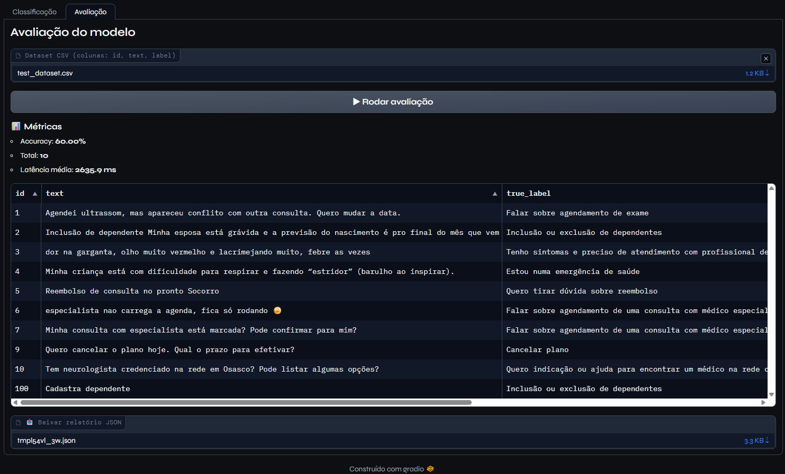
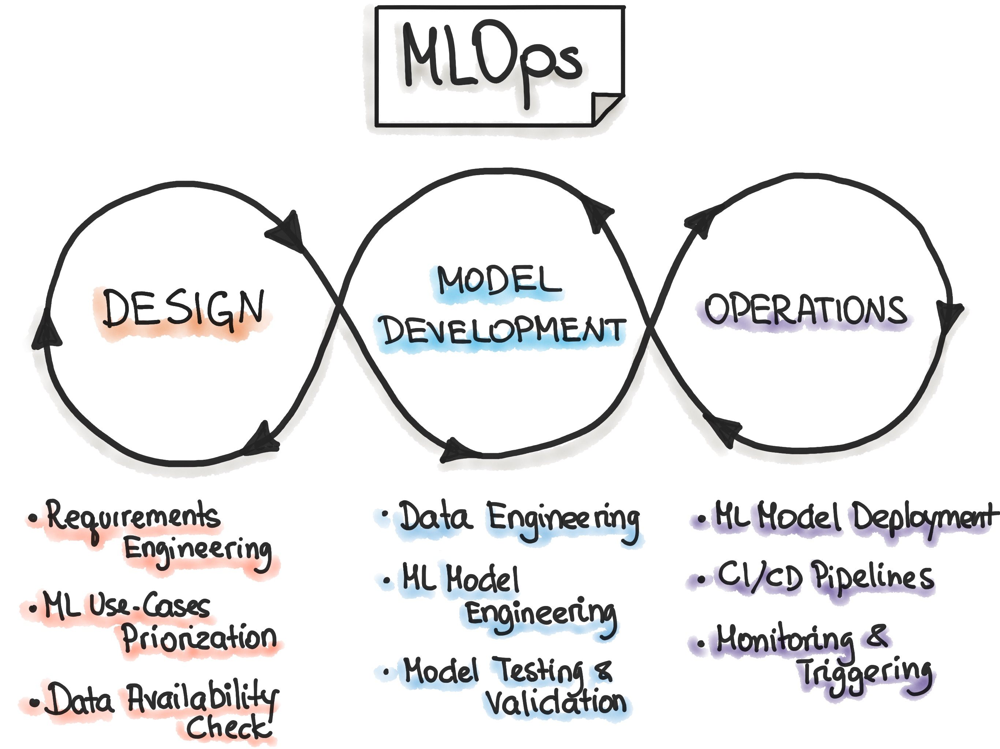

# Health Plan Support Classifier

Classificador automático de tickets de suporte de plano de saúde usando LLM (Claude), exposto via FastAPI.

---

## Stack e decisões de design

| Componente | Escolha | Justificativa |
|---|---|---|
| LLM | Meta - Bart Large MNLI | Zero-shot com prompt estruturado supera modelos menores treinados nos 100 exemplos disponíveis |
| Framework | FastAPI | Tipagem nativa com Pydantic, docs automáticas via Swagger, alto desempenho |
| Classificação | Zero-shot com system prompt | Rápido de iterar; o prompt é versionável como código |
| Métricas | Accuracy + Macro F1 + Confusion Matrix | Dataset balanceado → accuracy é representativa; F1 por classe expõe onde o modelo erra |

**Por que não fine-tuning?** Tendo como contexto somente os dados de exemplo, com apenas 100 amostras, não seria interessante realizar um processo de adaptação por sua fragilidade quanto a overfitting. 

---

## Estrutura do projeto

```
classifier/
├── app/
│   └── main.py          # FastAPI app (endpoint /classify)
│   └── gradio_ui.py     # Interface gráfica feita em gradio para executar a classificação e a avaliação em batch dos dados
├── scripts/
│   └── evaluate.py      # Avaliação em batch + geração de report
├── data/
│   └── classification_dataset.csv
├── reports/             # Criado automaticamente pelo evaluate.py (se executado diretamente)
├── requirements.txt
└── README.md
```

---

## Setup

### 1. Instalar dependências

```bash
pip install -r requirements.txt
```

### 2. Subir a API

```bash
uvicorn app.main:app --reload
```

```bash
python app/gradio_ui.py
```

*IMPORTANTE: Ao subir pela primeira vez a API app.main:app acontece o download do modelo facebook/bart-large-mnli pelo huggingface, portanto, a disponibilização da API pela primeira vez pode atrasar em até 10 minutos*

A API estará disponível em `http://localhost:8000`.

Documentação interativa: `http://localhost:8000/docs`

__A interface abre em__ `http://localhost:7860`.

---

## Endpoints

### `POST /classify`

Classifica uma mensagem de suporte.

**Request:**
```json
{ "text": "Minha filha está com febre alta e dificuldade para respirar." }
```

**Response:**
```json
{
  "predicted_label": "Estou numa emergência de saúde",
  "predicted_score": 0.8571,
  "is_valid_label": true,
  "latency_ms": 412.5
}
```

### `GET /labels`

Lista todas as categorias válidas.

### `GET /health`

Healthcheck da API.


## Interface

A interface da aplicação no Gradio (`http://localhost:7860`). é dividida em duas abas.


### Classificação

A aba **Classificação** permite:
- a visualização dos resultados
- o download de um arquivo CSV com as classificações e scores para cada texto de entrada
- o download de um relatório simples em PDF com o resumo das classificações realizadas na entrada de texto realiada



### Avaliação

A aba **Avaliação** permite:
- a visualização dos resultados
- o download de um arquivo json com o resultado das classificações das entradas de texto



---

## Avaliação em batch (Parte 2)

Também disponível na aba "Avaliação" da interface gráfica com Gradio

Com a API rodando, execute:

```bash
python scripts/evaluate.py \
    --dataset data/test_dataset.csv \
    --output  reports/evaluation_report.json \
    --api-url http://localhost:8000
```

O script:
1. Lê cada linha do CSV
2. Chama `POST /classify` para cada mensagem
3. Compara com o ground truth
4. Gera um report em `reports/evaluation_report.json` com:
   - Accuracy, Macro F1, Weighted F1
   - F1, Precision, Recall por classe
   - Matriz de confusão completa
   - Top erros de classificação
   - Estatísticas de latência (mean, P50, P90, P99)
5. Gera um report em `reports/evaluation_report.md` com:

```
=================================================================
  EVALUATION REPORT
=================================================================
  Samples evaluated : 100 / 100
  Accuracy          : 94.00%
  Macro F1          : 93.85%
  Weighted F1       : 93.85%

  LATENCY
  Mean: 387ms  |  P50: 361ms  |  P90: 512ms  |  P99: 743ms

  PER-CLASS F1
  1.00 ████████████████████  [10]  Cancelar plano
  0.95 ███████████████████   [10]  Críticas ou sugestões
  ...

  TOP MISCLASSIFICATIONS
  [2x]  "Tenho sintomas e preciso de atendimento..."
        → "Estou numa emergência de saúde"
=================================================================
```

---


## Métricas escolhidas e justificativa

| Métrica | Por quê |
|---|---|
| **Accuracy** | Dataset balanceado → métrica simples e direta |
| **Macro F1** | Trata todas as classes com igual peso; penaliza classes com baixo desempenho |
| **F1 por classe** | Identifica onde o modelo está sistematicamente errando |
| **Matriz de confusão** | Revela padrões de confusão (ex: sintomas vs emergência) |
| **Latência (P50/P90/P99)** | Essencial para SLA em produção; P99 expõe outliers |

---

## Decisões e motivação

### Interface

A interface construída em gradio foi escolhida dessa froma pela simplicidade e pela facilidade em testar a aplicação em uma solução simples. Levando para produção, a decisão de interface mudaria para se adequar a outros sistemas já existentes para se adequar às práticas já adotadas e padronizadas de UX e UI.

### Práticas de coding com AI

Para garantir que todo o código funcionasse corretamente no final, a principal estratégia adotada foi a separação do problema em partes menores e endereçáveis como funções específicas e reaproveitáveis.

Além disso, a cada nova inserção no código, todo o funcionamento da solução foi re-testado para garantir a integração correta de todo o sistema. 

Em uma solução mais completa e robsuta pode acontecer uma inviabilidade da execução de testes manuais em todo o sistema, nesse caso existe a possibilidade da realização de testes automatizados e da modularização do desenvolvimento, aqui eu quero dizer compartimentalização, de forma que a alteração em um componente do código afete o mínimo possível módulos distintos da solução e sua utilização em outros módulos seja rastreável, de forma que o impacto de uma alteração na solução completa seja, também, rastreável e controlado.

Resumindo, além de controlar as alterações, não permitindo a alteração de arquivos inteiros, por exemplo, uma boa prática é a implementação de um pipeline de CI/CD para as alterações de código e versionamento.

### Versionamento

#### Prompt como código
Fazendo parte da solução, qualquer prompt utilizado com o modelo de classificação também deve ser versionado e avaliado antes de entrar em produção, assim como um código passa por uma pipeline de CI/CD o prompt também deve passar, nesse caso.

Eu entendo versionamento de soluções baseadas em IA muito próximo de observabilidade, até por uma questão de boas práticas em MLOps:



Inclusive, é possível a utilização do código `evaluate.py` como um CI gate para uma primeira etapa de monitoramento, pelo menos do monitoramento do comportamento do modelo de classificação levando à primeira etapa de um MLOps.

#### Observabilidade

Aprofundando no tema observabilidade, além de permitir monitorar o comportamento e resultados do modelo, de forma que é possível identificar um momento que aconteçam falhas na operação por uma mudança na característica dos dados de entrada e, com isso, retornar à etapa de levantamento de requisitos para possibilitar a criação de uma nova versão estruturada da solução com boas práticas de desenvolvimento de soluções baseadas em IA, a ideia é monitorar a saúde do ambiente, em um ambiente produtivo, entendo que métricas de IOPS são importantes para verificar a disponibilidade do sistema, além de verificar latência da resposta, monitorar o comportamento de cada função por meio de logs ajuda a rastrear possíveis erros e corrigir de forma mais assertiva.

Aqui eu sou a favor de guardar todos os logs da solução, pelo menos por um período relevante de tempo (com relevante eu quero dizer um período suficiente para identificar mudanças de comportamento da solução, mas não exagerado a ponto de afetar na memória ou armazenamento do ambiente), guardaria as informações de execução em cada uma das funções e APIs da solução completa, IOPS e avaliações do modelo.

Aqui, com informações de execução eu quero dizer:
- Entrada e saída da função ou API
- Latência
- Warnings de execução
- Erros de execução
- Timestamp da execução
- Status de resposta de APIs
- Monitoramento de respostas da LLM (de classificação)
  - Isso foi implementado no código por meio de uma variável: `is_valid_label` que indica se o modelo está utilizando somente as categorias já definidas no escopo ou está criando categorias novas, esse comportamento deve ser observado como um indicativo de alucinação do classificador o que pode comprometer a confiabilidade da solução

### Alternativas de modelagem

Devido à quantidade de amostras disponíveis, a modelagem da solução foi a **Zero-Shot**, uma forma de melhorar a qualidade da solução (em termos de precisão e acurácia) é trocando o método de treinamento do modelo para alternativas como:

- **Few-shot**: para reduzir a quantidade de classificações incorretas entre classes similares e com alto overlay de definição (exemplo: **Falar sobre agendamento de uma consulta com médico especialista** e *Quero indicação ou ajuda para encontrar um médico na rede credenciada*)
- **Fine-tuning**: pensando em uma solução já escalada com volumes de dados mais expressivos
- Caso a ideia seja utilizar modelos mais clássicos de classificação, também é possível utilizar modelos de NLP classificados com métodos mais clássicos de ML. Solução essa também pensada para cenários mais escalados devido o volume de dados necessário para possibilitar o treinamento e teste do modelo mais clássico

### Escalabilidade

Para pensar em escalabilidade em um sistema, as boas práticas começam por evitar gargalos antes de aumentar a complexidade. Nesse caso, antes de escalar o serviço, buscaria melhorar a escalabilidade horizontal da solução permitindo, por exemplo a utilização do serviço por vários usuários simultâneos na criação de uma solução que não guarda o estado do usuário na memória da solução, mas mantendo registro da sessão em um banco ou em cache, otimizar consultas com índices, paginação e modelagem de dados. 

Outro ponto é aumentar a especialização dos componentes do sistema e não criar monolitos. Comunicar componentes de forma inteligente e separar as responsabilidades, além de permitir controle de erros mais preciso, ajuda na manutenção e melhoria da solução em partes, bem como testes e pipelines de CI/CD mais precisas.

Além disso, implementar processamento assíncrono para tarefas que não precisam acontecer imediatamente, como envio de e-mails, geração de relatórios e integrações com outros serviços, usando filas para não sobrecarregar o fluxo principal da aplicação e mecanismos de resiliência (timeout, retry com backoff, circuit breaker e rate limiting) para evitar falhas em cascata e manter o sistema estável mesmo sob picos de uso ou problemas externos.

Manter o processo de MLOps funcional ajuda a garantir a escalabilidade do sistema. É fundamental ter observabilidade e logs estruturados, métricas, alertas e testes de carga para identificar gargalos na aplicação e, finalizando, a verificação de saúde da API com um health check no endpoint /health também é uma prática importante para monitorar rapidamente se o serviço está disponível e funcionando corretamente, não seria necessário implementar para todas as integrações, mas para a API principal do sistema.
